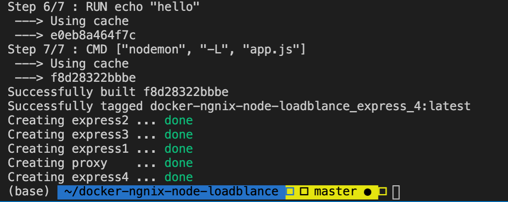
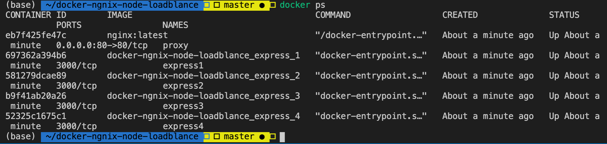
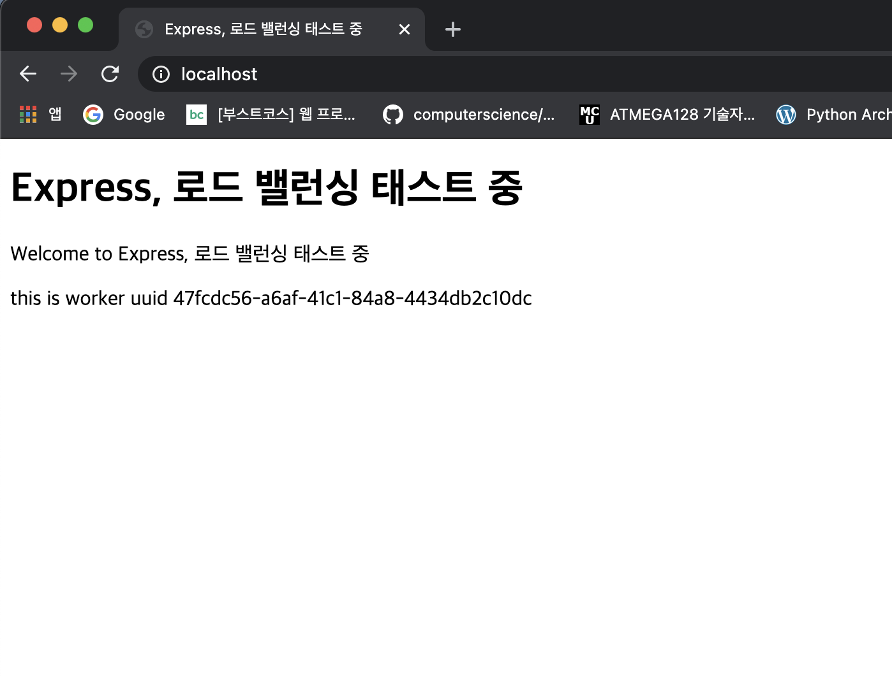
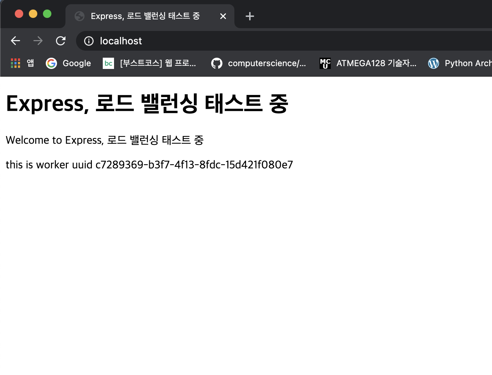
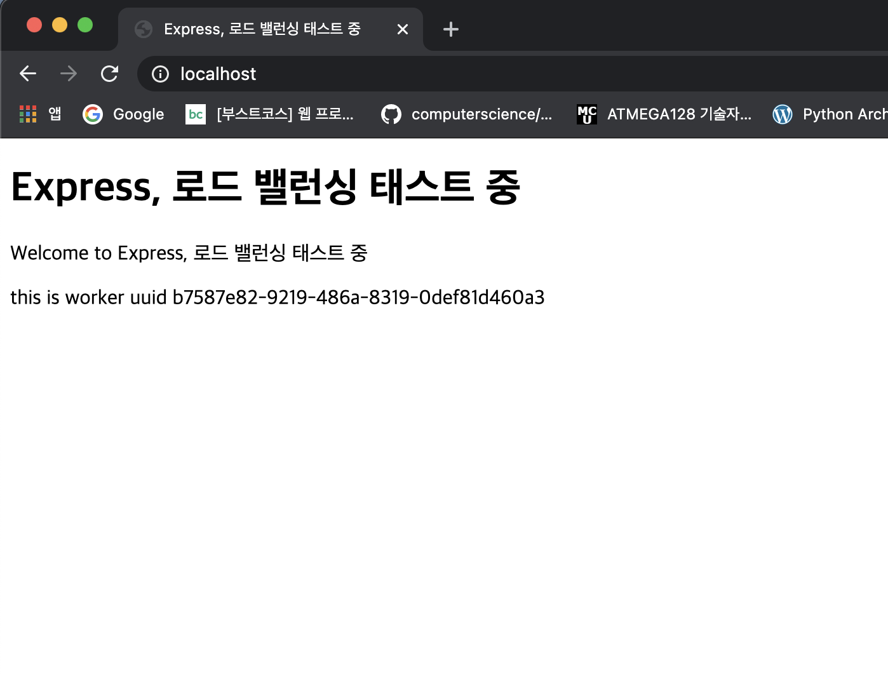
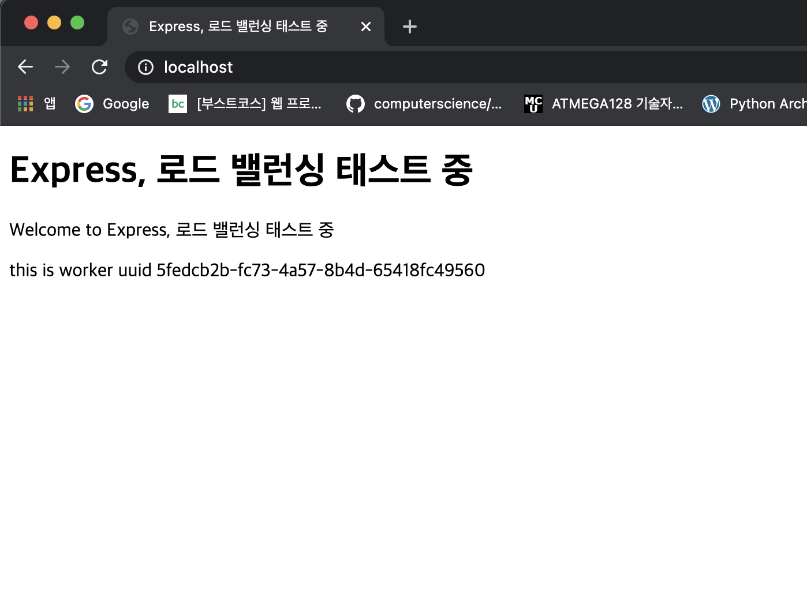

# Nginx와 Node를 Docker를 활용해 로드밸런싱 & 배포


## 컨셉

- nginx는 리버스 프록시 서버로 작동할것이며. 80번포트로 오는 요청들을 각 노드 서버에게 로드밸런싱하여 뿌려줄것이다
    - 예를들어
        - expree1 3000번
        - express2 3000번
        - express3 3000번
        - express4 3000번
    - 이렇게 4개의 노드 서버가 떠있다면 로드밸런싱 알고리즘에 맞추어서 나눠줄것임.

- nginx와 node 모두 도커를 이용할것이며, Dockerfile 및 docker-compose.yml을 활용한다.

### 실제 결과

`docker-compose up -d --build`



- docker-compose 커맨드 수행 결과. express1,2,3,4 컨테이너 및 proxy 컨테이너 생성



- 각 node 서버가 3000번으로 떠있다.

- nginx conf에 가장 연결이 적게된 서버로 연결을 시키는 least_conn 알고리즘 상태에서의 테스트 수행결과
- 각 서버는 자신만의 고유아이디를 갖고있다.






- 총 4개의 각기 다른 uuid 확인 가능했다.


- nginx conf

```conf
user  nginx;
worker_processes  1;

error_log  /var/log/nginx/error.log warn;
pid        /var/run/nginx.pid;

events {                     
    worker_connections  1024;
}                            

http {
    include       /etc/nginx/mime.types;
    default_type  application/octet-stream;

    upstream docker-express { # 1
        least_conn;
        server express1:3000 weight=10; #각 컨테이너의 이름이 들어가야 함
        server express2:3000 weight=10; #나는 도커 컴포즈에 각 express1,2,3,4 이렇게 정의해서 그럼
        server express3:3000 weight=10;
        server express4:3000 weight=10;
    }

    server {
        listen 80;
        server_name localhost;

        location / {
		proxy_http_version 1.1;
            	proxy_pass         http://docker-express; # 2
        }

    }

    log_format  main  '$remote_addr - $remote_user [$time_local] "$request" '
                      '$status $body_bytes_sent "$http_referer" '
                      '"$http_user_agent" "$http_x_forwarded_for"';

    access_log  /var/log/nginx/access.log  main;
                                                
    sendfile        on;                                                                         
    keepalive_timeout  65;                                                                      
    include /etc/nginx/conf.d/*.conf;           
}
```

```yml
version: '3'
services:
  proxy: #reverse proxy와 로드밸런싱을 위한 nginx
    image: nginx:latest
    container_name: proxy
    ports:
      - "80:80"
    volumes:
      - ./nginx.conf:/etc/nginx/nginx.conf
    restart: "unless-stopped"
  express_1:
    build:
      context: ./server
    container_name: express1
    expose:
      - "3000" #첫번쨰 노드 서버는 3000번
    volumes:
      - ./source:/source
      - /source/node_modules
    restart: "unless-stopped"
  express_2:
    build:
      context: ./server
    container_name: express2
    expose:
      - "3000" 
    volumes:
      - ./source:/source
      - /source/node_modules
    restart: "unless-stopped"
  express_3:
    build:
      context: ./server
    container_name: express3
    expose:
      - "3000" 
    volumes:
      - ./source:/source
      - /source/node_modules
    restart: "unless-stopped"
  express_4:
    build:
      context: ./server
    container_name: express4
    expose:
      - "3000" 
    volumes:
      - ./source:/source
      - /source/node_modules
    restart: "unless-stopped"

```

- 위는 도커 컴포즈 파일

### 이 예제를 사용하는 방법

- `docker-compose up -d --build`